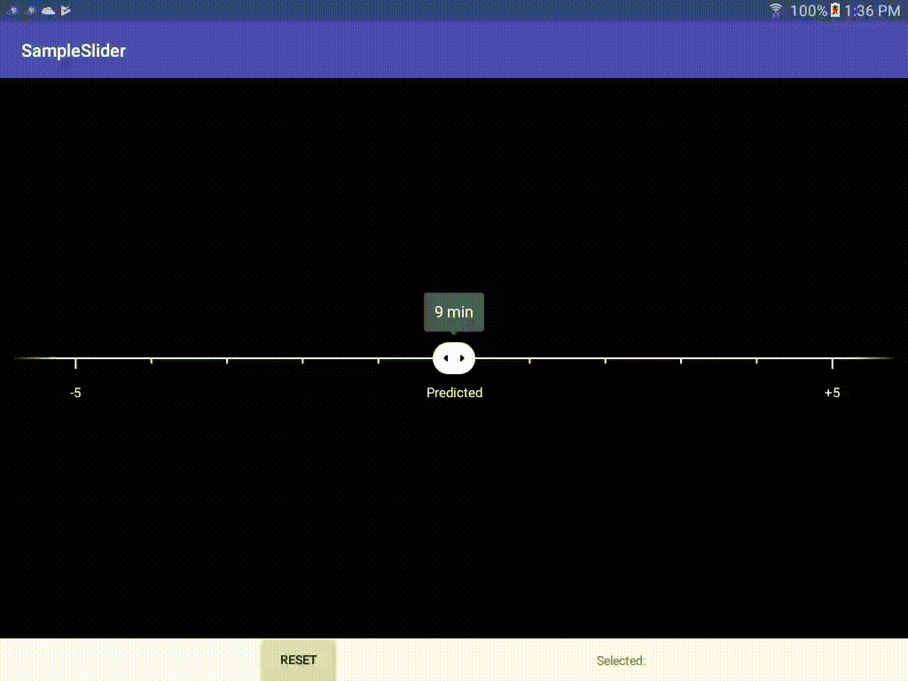

# Center Slider View



## Usage

Feel free to browse the sampleslider module for an example of how to use this view.

### Early Caveats
* This project is currently not available in jcenter.  I hope to do this in the near
future to make it easier to import.
* The minimum api for this library is 23(M) because `AnimatedVectorDrawable`s have
a minimum API of 23 to call `reset()`.
* Most of the UI is drawn directly to the canvas and accessibility has not been added
to this widget.

### Getting started

Clone the project and link to the module/project

```
dependencies {
   implementation project(":centersliderview")
}
```

### Adding the widget

The `CenterSliderView` is a widget, like a typical widget and can be added directly to
your layout files in xml.

See the [wiki page on xml attributes][3] for more details.

### Managing the view

When it's time to use the view, a `SliderInfo` needs to be passed to the `setSliderInfo`
method on the `CenterSliderView`.  This can be done using the `SliderInfo`'s `Builder`:

```
CenterSliderView.SliderInfo info =
    new CenterSliderView.SliderInfo.Builder()
            .setBounds(0, 60)
            .setIntervalsToEdge(6)
            .setLargeTickInterval(5)
            .setStartValue(27)
            .setValueTextOverride(27, "Predicted")
            .build();
sliderView.setSliderInfo(info);
```

## The nitty-gritty

Android has used two different names to describe this type of widget.  The material design
guidelines call it a [discrete slider][1] whereas the original widget in Android's codebase
is the [android.widget.SeekBar][2].  This custom view adopts the more recent slider name.

### Behavior

This widget selects a single value between a given min and max range, as would be expected
from a discrete slider.  Instead of showing the entire range, it shows a smaller subset
of the allowed numbers and allows the user to pick between that subset.  Once a number is
chosen, the baseline will animate to recenter itself, such that the dragger sits in the
center of the view again.

### Implementation Details

This slider is primarily achieved by drawing directly to the canvas in `onDraw()` (not by
adding views to a viewgroup).  It uses two `AnimatedVectorDrawable`s to animate the 
dragger's expanding and contracting states.  The two drawables are swapped out when the
user presses down on the dragger and then lifts up.

The animations themselves are processed by a handler that runs every 16 ms
(~= 60 frames/sec) and calls `invalidate()`, which then calls `onDraw()`.

### References:

[xml attributes][3]  
[slider design link][1]  
[developer seekbar link][2]  

[1]: https://material.io/guidelines/components/sliders.html
[2]: https://developer.android.com/reference/android/widget/SeekBar.html
[3]: https://github.com/postmates/centersliderview-android/wiki/XML-attributes